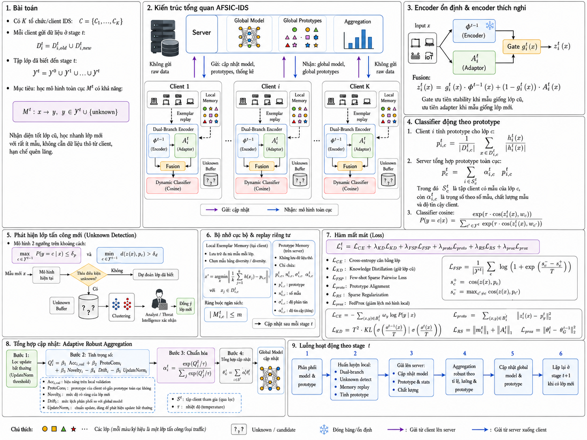

# AFSIC-IDS: Adaptive Federated Few-Shot Class-Incremental Learning for IDS

This repository contains the implementation of an advanced **Federated Few-Shot Class-Incremental Learning** framework designed for Intrusion Detection Systems (IDS), named **AFSIC-IDS** (Adaptive Federated Stability-plasticity Incremental Classifier).

It extends the core ideas of the SPCIL framework into a non-IID Federated Learning environment, solving the challenges of detecting new network attacks dynamically across decentralized clients.

---

## 🎯 Architecture Overview



The AFSIC-IDS framework consists of several key innovations designed specifically for Federated IDS:

1. **Frozen Global Stability Encoder + Lightweight Plasticity Adapters**:
   Instead of expanding the entire backbone for every new attack class, we freeze the stability encoder (to prevent catastrophic forgetting) and train a lightweight local adapter (to learn plasticity for new attacks). A dynamically learned **Vector Gate** $g_i^t(x)$ fuses these two branches depending on the input traffic.

2. **Prototype-Assisted Classifier Fusion**:
   For new attack classes where only a few samples (e.g., 5-10 shots) are available, we initialize the classification weights using aggregated class Prototypes instead of random initialization.

3. **Privacy-Aware Memory (Replay)**:
   - **Local Exemplar Memory**: Each client stores exactly 1% of representative samples using the **Herding Selection** algorithm to preserve long-term memory without eating up local RAM.
   - **Global Prototype Memory**: The server only receives and aggregates vectors (Prototypes) instead of raw packet/flow data.

4. **Multi-Objective Loss Function**:
   The model optimizes a sophisticated loss suite:
   $L = L_{CE} + \lambda_{KD} L_{KD} + \lambda_{FSP} L_{FSP} + \lambda_{proto} L_{proto} + \lambda_{RS} L_{RS} + \lambda_{prox} L_{prox}$
   This balances class preservation, few-shot feature learning (Sparse Pairwise Loss), and reduces client drift in Non-IID settings.

5. **Adaptive Robust Aggregation**:
   The server doesn't use simple `FedAvg`. It calculates a quality score ($Q_i^t$) based on accuracy, prototype consistency, novelty, drift, and update norms to apply an adaptive Softmax weight $\alpha_i^t$. It also utilizes **MAD Z-Score filtering** to block poisoned or overly dispersed client updates.

---

## 🚀 How to Run

### 1. Setup Data
The system is pre-configured to run with the **CIC-IoT23** dataset. Make sure your pre-processed data is located in the appropriate directory as specified in the `utils/data_manager.py`.

### 2. Configure Experiments
All hyperparameters and incremental steps are defined cleanly in `configs/exps/cic_iot23_afsic.json`.
Example configuration:
```json
{
  "prefix": "cic_iot23",
  "dataset": "cic_iot23",
  "memory_ratio": 0.01,
  "task_increments": [6, 6, 6, 6, 5, 5],
  "class_order": [1, 0, 11, 12, 27, 26, 2, 14, 25, 24, 20, 28, 3, 7, 30, 29, 19, 16, 15, 6, 8, 22, 23, 21, 5, 13, 10, 17, 18, 4, 31, 32, 33, 9],
  "model_name": "afsic-ids",
  "num_clients": 10,
  "num_rounds": 30
}
```

### 3. Start Training
To start the federated training loop:
```bash
python main.py --config configs/exps/cic_iot23_afsic.json
```

### 4. Evaluate & Metrics
The training orchestrator automatically computes and logs 14 critical metrics per round (saved in `metrics_round_by_round.csv`), including:
- **Accuracy** (Top-1)
- **F1-Score** (Micro, Macro, Weighted)
- **Precision / Recall** (Micro, Macro, Weighted)
- **Catastrophic Forgetting** tracking

To run an offline test pipeline on saved checkpoints:
```bash
python main.py --config configs/exps/cic_iot23_afsic.json --test
```
*(Make sure to set the checkpoint directory path in your arguments or config file).*
